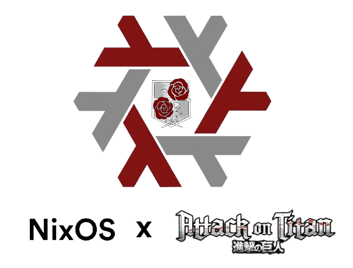

<p align = "cenleftter">
  
</p>

## NixDot 

This repo contains more configurations, for different devices. Is not recommandedd the installation, but you can also remove the **hardware-configuration.nix** files from each and replace with yours and try to download them. 

## Install the system 
   ```bash
   nixos-generate-config --root /mnt 
   && cd /mnt/etc/nixos 
   && git clone https://Zaque-69/Nixdot.git 
   && mv Nixdot/* . 
   # optional, but recommanded if you changed some hardware
   && rm hosts/{device}/{username}/hardware-configuration.nix 
   && mv hardware-configuration.nix hosts/{device}/{username} 
   && nixos-install --flake .#device
   ```

## Rebuild the system ( If you already have installed a Desktop/Window manager )
   ```bash
   nixos-rebuild switch --flake .#user
   ```

## Download the packages
  ``` bash
  home-manager switch --flake .#user
  ```

After downloading all the stuff using home-manager, run the shell file to move some directories and files from this configuration on your device : 

  ```bash
  nix-shell
  ```
## Updates
- **05.02.2025: NVIDIA drivers added to the desktop configuration + Waybar modification** .
- **21.02.2025: A new device was added : a lenovo Laptop with Ryzen 3, 1T HDD, 4GB RAM, minimalist configuration ( KDE DM )** .
- **03.05.2025: New theme added on Desktop : "dust&velvet"** .
- **25.05.2025: New theme added on Desktop : "blackbg"** .
