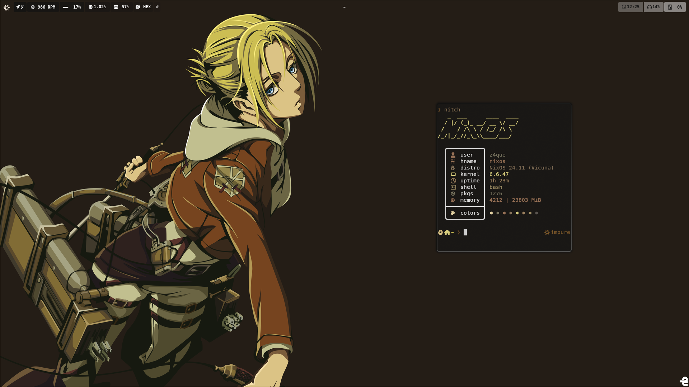

<p align = "cenleftter">
  
</p>

## NixDot x Attack on Titan
This repo contain a Python script designed for systems configured with Hyprland. It enables users to switch the system's background theme by running commands like theme1, theme2, ..., theme12 in the terminal. The script leverages Nix's declarative capabilities to manage and apply themes efficiently. The script can be run after the instalation.

## Key Features
- **Simple Commands:** Change themes instantly with commands like `theme1` to `theme12`.
- **Python-Powered:** Built using Python for flexibility and ease of customization.
- **Nix Integration:** Seamlessly integrates with Nix-managed configurations for consistent behavior.

## Demonstration 

<p align = "center">
  
</p>

## Clone this repository:
   ```bash
   git clone https://github.com/Zaque-69/nixdot.git
   cd Nixdot-main
   ```

## Rebuild the system
   ```bash
   nixos-rebuild switch --flake .#nixos
   ```
## Download the packages
  ``` bash
  home-manager switch --flake .
  ```

After downloading all the stuff using home-manager, run the shell file to move some directories and files from this configuration on your device : 

  ```bash
  nix-shell
  ```

# Images 

<p align = "center">
  
</p>

<p align = "center">
  
</p>

<p align = "center">
  
</p>

<p align = "center">
  
</p>

<p align = "center">
  
</p>

<p align = "center">
  
</p>

<p align = "center">
  
</p>

<p align = "center">
  
</p>

<p align = "center">
  
</p>

<p align = "center">
  
</p>

<p align = "center">
  
</p>

<p align = "center">
  
</p>
