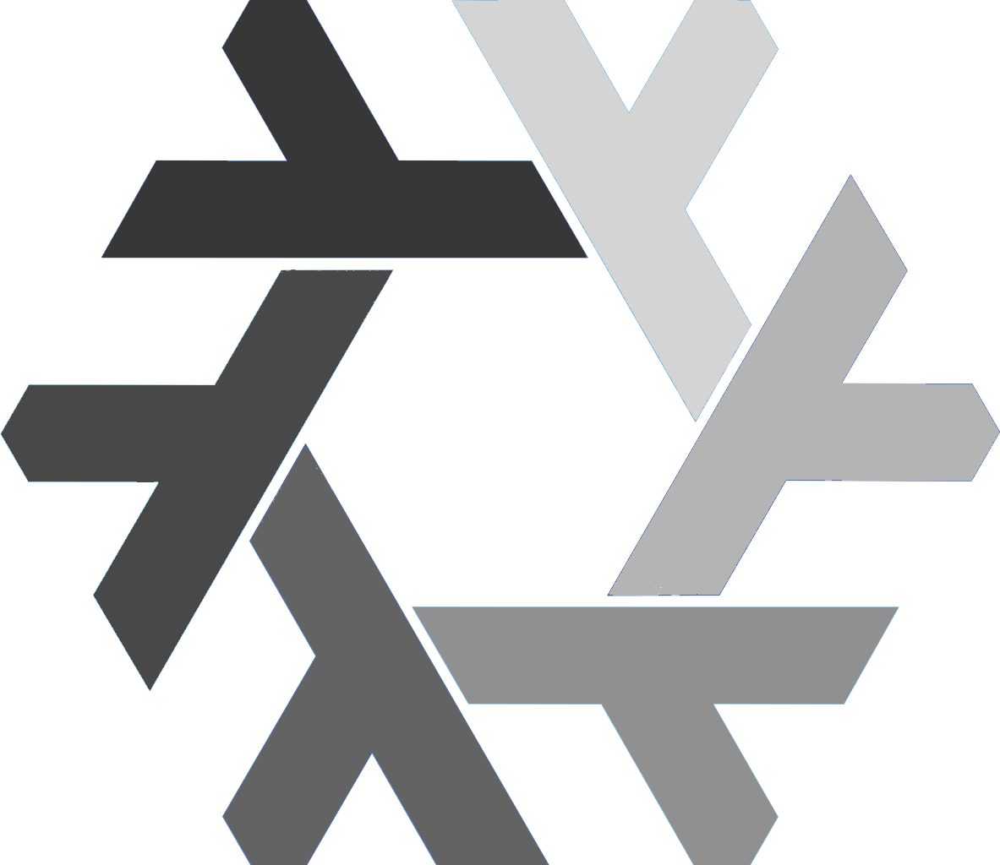
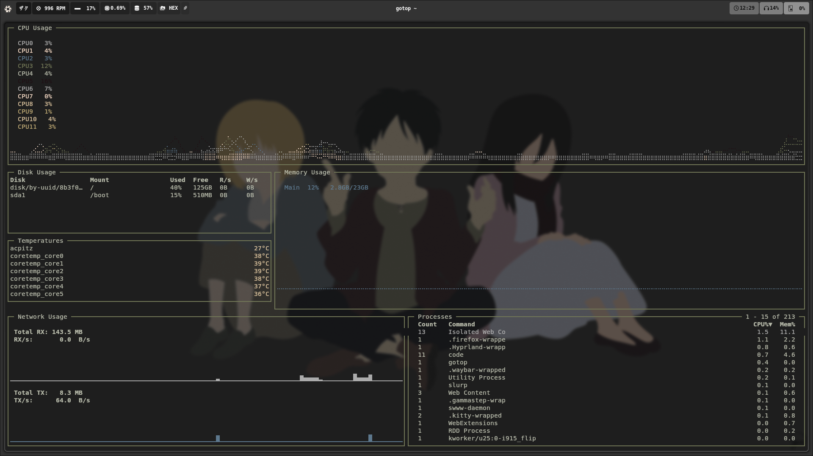

<p align = "cenleftter">
  
</p>

## NixDot 

This repo contains more configurations, for different devices. Is not recommandedd the installation, but you can also remove the **hardware-configuration.nix** files from each and replace with yours and try to download them. 

The desktop configuration (mines) contain a Python script designed for systems configured with Hyprland. It enables users to switch the system's background theme by running commands like "hyprimage 1", "hyprimage 2", ..., "hyprimage 17" in the terminal. The script leverages Nix's declarative capabilities to manage and apply themes efficiently. The script can be run after the instalation.

## Key Features ( main configuration )
- **Simple Commands:** Change themes instantly with commands like `hyprimage 1` to `hyprimage 17`.
- **Python-Powered:** Built using Python for flexibility and ease of customization.
- **Nix Integration:** Seamlessly integrates with Nix-managed configurations for consistent behavior.

## Demonstration 

<p align = "center">
  
</p>

## Install the system 
   ```bash
   nixos-generate-config --root /mnt 
   && cd /mnt/etc/nixos 
   && git clone https://Zaque-69/Nixdot.git 
   && mv Nixdot/* . 
   # optional, but recommanded if you changed some hardware
   && rm hosts/{device}/{username}/hardware-configuration.nix 
   && mv hardware-configuration.nix hosts/{device}/{username} 
   && nixos-install --flake .#device
   ```

## Rebuild the system ( If you already have installed a Desktop/Window manager )
   ```bash
   nixos-rebuild switch --flake .#user
   ```

## Download the packages
  ``` bash
  home-manager switch --flake .#user
  ```

After downloading all the stuff using home-manager, run the shell file to move some directories and files from this configuration on your device : 

  ```bash
  nix-shell
  ```
## Updates
- **05.02.2025: NVIDIA drivers added to the desktop configuration + Waybar modification** .
- **21.02.2025: A new device was added : a lenovo Laptop with Ryzen 3, 1T HDD, 4GB RAM, minimalist configuration ( KDE DM )** .


# Images 

### Main desktop configuration

<p align = "center">
  
</p>

<p align = "center">
  
</p>

<p align = "center">
  
</p>

<p align = "center">
  
</p>

<p align = "center">
  
</p>

<p align = "center">
  
</p>

<p align = "center">
  
</p>

<p align = "center">
  
</p>

<p align = "center">
  
</p>

<p align = "center">
  
</p>

<p align = "center">
  
</p>

<p align = "center">
  
</p>

<p align = "center">
  
</p>

<p align = "center">
  
</p>

<p align = "center">
  
</p>

<p align = "center">
  
</p>

<p align = "center">
  
</p>

<p align = "center">
  
</p>

### Lenovo configuration

<p align = "center">
  
</p>
